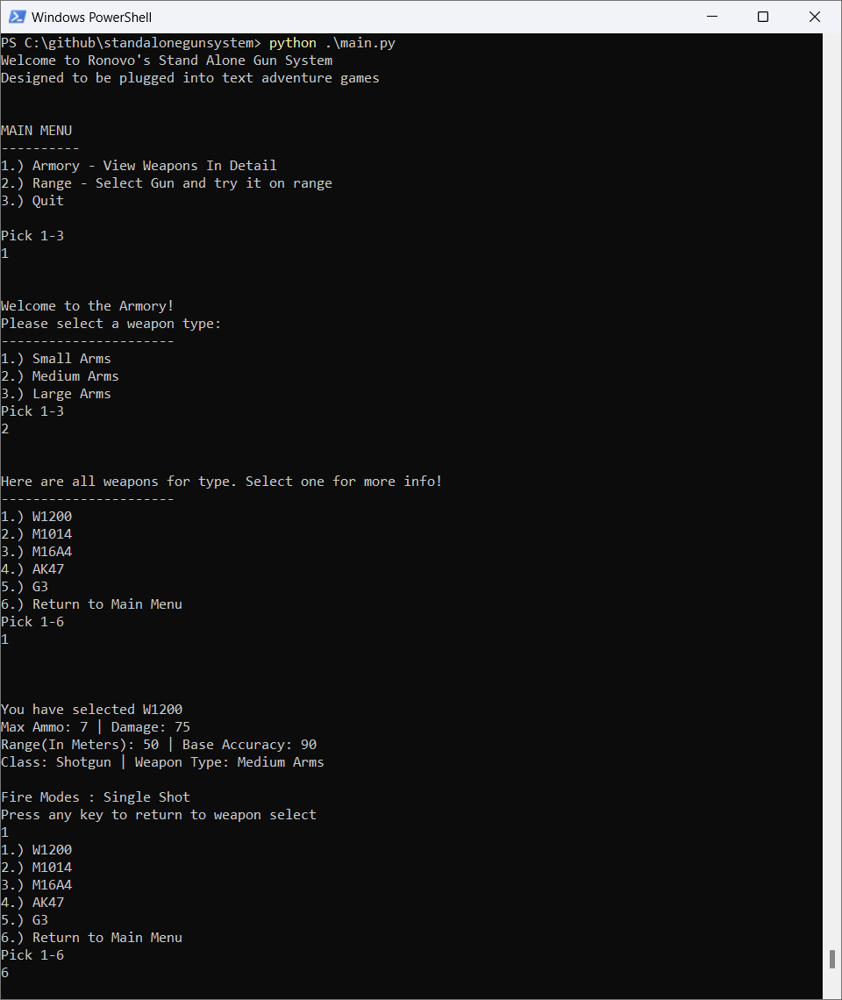
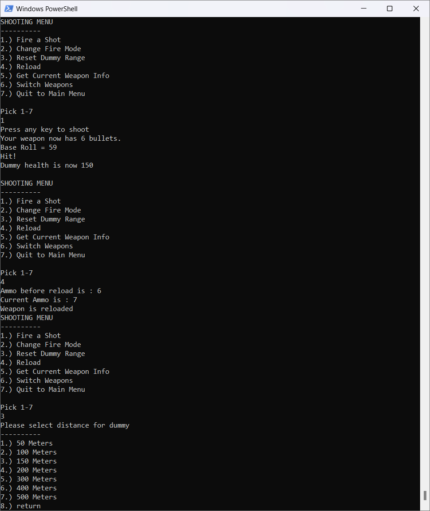

# Stand Alone Gun System (Text-Based)
Simple Weapons System built completely in Python. Ready to be ported into any game idea you can come up with!

  
   
  

## Set Up and Run
### 1.) Requires Python to be installed
  - Version used for this build : V3.13.2
  - Get [Python](https://www.python.org/downloads/) here.
  - Run the Installer

### 2.) Download the project (Through Git or File Download)

### 3.) Navigate to file with Powershell/Command Prompt
  - cd (drive)/(File Location)/standalonegamesystem
  - Once there, run "python ./main.py"
### 4.) Game should start in your terminal window

## V1.5 Features
- Hit Calculation
  - Dummy Size, Damage Drop off, "Bullet Drop", Muzzle Spray, Critical Chance
- Armory Menu to look at all your guns!
- Gun Range to test out all your guns!
  - Bulk Fire report to test weapon balancing
  - Dynamic hit calculation based on Target Distance and Gun Type!
  - Counter to keep track of how many Dummies you have destroyed in the session!
  - Bulk Firing Options Per Gun
- Balance Report Funcationality
    - Creates a report per weapon in /Balance Reports
    - Each Report includes stats for 3 Full Magazines shot at:
        - Each Type of Dummy
        - Every Range listed in the Range Menu
        - For Each Firing Mode (Single, 3 Round, Auto)
- 25 Guns, with 6 different weapon types! (See List Below!)

## Future Updates
- More Guns!!!!

## Gun List
### Pistols (Small Arms)
- M1911
- USP. 45
- M9
- Desert Eagle
- Glock 18
- .38 Special
- 44 Magnum

### SMG (Small Arms)
- MP5
- AK-47u
- p90
- Mini Uzi

### Shotguns (Medium Arms)
- W1200
- M1014
- USAS-12

### ARs (Medium Arms)
- M16A4
- AK47
- G3
- G36
- FN FAL

### Snipers(Heavy Arms)
- M40A3
- Dragunov
- Barrett .50Cal

### LMGs(Heavy Arms)
- M249 Saw
- M60E4
- RPD
