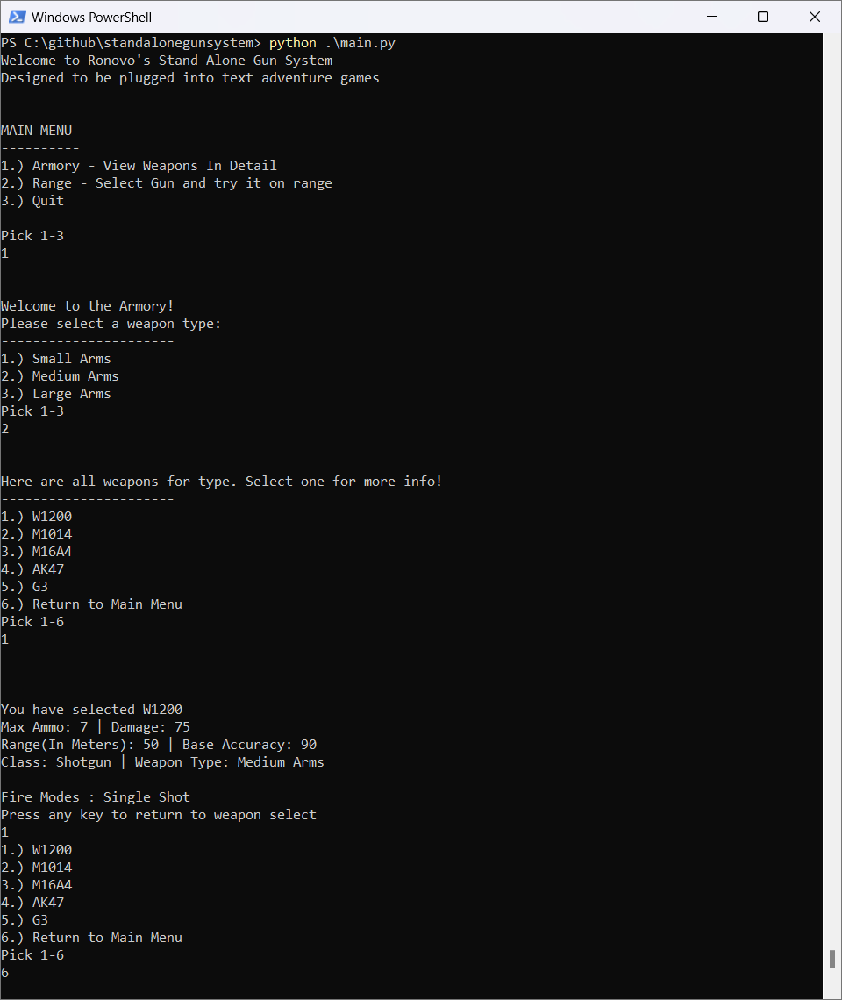
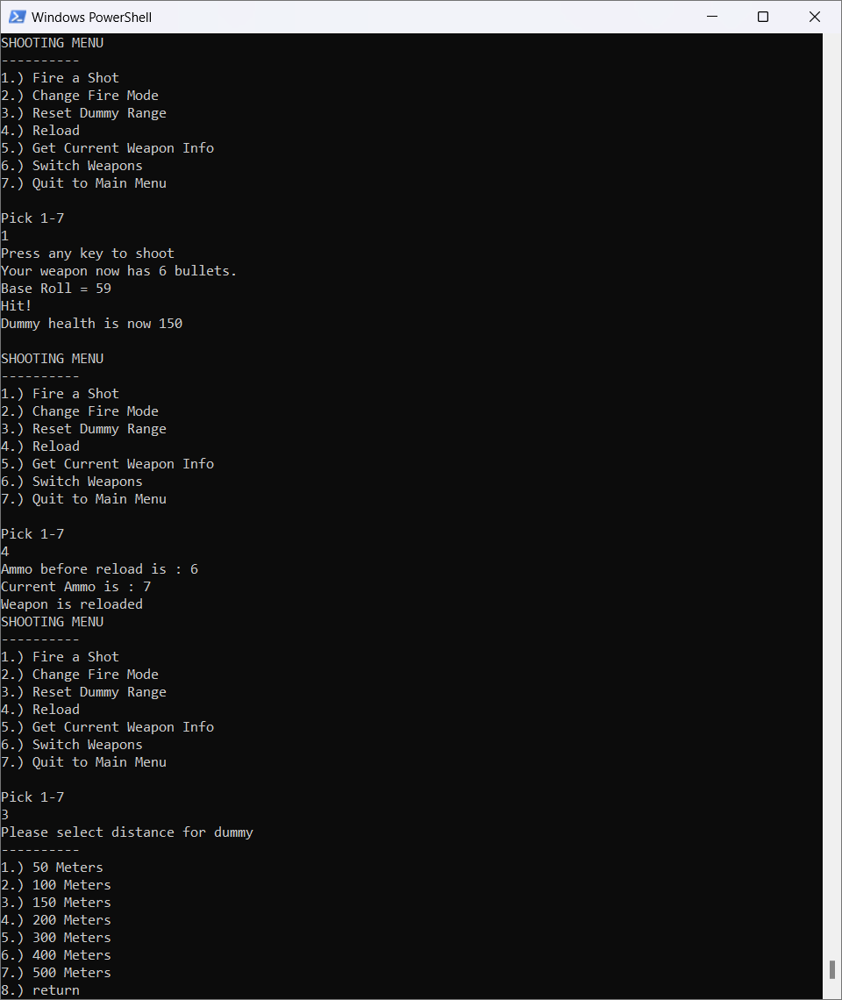

# Stand Alone Gun System (Text-Based)
Simple weapons system built in Python. The `gunsystem` library can be imported into other games; this repo also includes a terminal range demo.

<p float="left">
  
   
  
</p>

## Set Up and Run
### 1.) Requires Python to be installed
  - Requires Python 3.10 or newer
  - Version used for this build: 3.13.2
  - Get [Python](https://www.python.org/downloads/) here.
  - Run the Installer

### 2.) Download the project (Through Git or File Download)

### 3.) Navigate to the project with Powershell/Command Prompt
  - `cd (drive)/(File Location)/standalonegunsystem`
  - Once there, run `python ./main.py`
  - You can also run `python -m demo`
### 4.) Game should start in your terminal window

## Using as a library
From the repo (or with `gunsystem/` on your Python path):

```python
from gunsystem import Catalog, Target, resolve_shot

gun = Catalog.create("M1911")
gun.reload()
result = resolve_shot(gun, Target(distance=100, size="m"))
```

`result` has `hit`, `damage`, `critical`, and `remaining_ammo`.

## Tests
From the repo root:

```
python -m unittest discover -s tests -t .
```

## V1.5 Features
- Hit Calculation
  - Dummy Size, Damage Drop off, "Bullet Drop", Muzzle Spray, Critical Chance
- Armory Menu to look at all your guns!
- Gun Range to test out all your guns!
  - Bulk Fire report to test weapon balancing
  - Dynamic hit calculation based on Target Distance and Gun Type!
  - Counter to keep track of how many Dummies you have destroyed in the session!
  - Bulk Firing Options Per Gun
- Balance Report Functionality
    - Creates a report per weapon in /Balance Reports
    - Each Report includes stats for 3 Full Magazines shot at:
        - Each Type of Dummy
        - Every Range listed in the Range Menu
        - For Each Firing Mode (Single, 3 Round, Auto)
- 26 Guns, with 6 different weapon types! (See List Below!)

## Future Updates
- More Guns!!!!

## Gun List
### Pistols (Small Arms)
- M1911
- USP .45
- M9
- Desert Eagle
- Glock 18
- .38 Special
- 44 Magnum

### SMG (Small Arms)
- MP5
- AK-47u
- P90
- Mini-Uzi

### Shotguns (Medium Arms)
- W1200
- M1014
- USAS-12
- Spas-12

### ARs (Medium Arms)
- M16A4
- AK47
- G3
- G36
- FN FAL

### Snipers (Large Arms)
- M40A3
- Dragunov
- Barrett .50Cal

### LMGs (Large Arms)
- M249 SAW
- M60E4
- RPD
